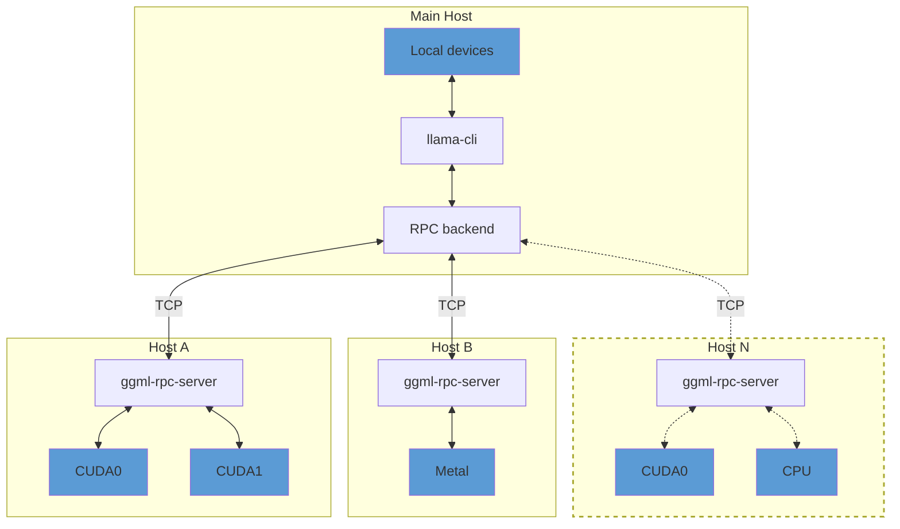

## Overview

> [!IMPORTANT]
> This example and the RPC backend are currently in a proof-of-concept development stage. As such, the functionality is fragile and
> insecure. **Never run the RPC server on an open network or in a sensitive environment!**

The `ggml-rpc-server` allows exposing `ggml` devices on a remote host.
The RPC backend communicates with one or several instances of `ggml-rpc-server` and offloads computations to them.
This can be used for distributed LLM inference with `llama.cpp` in the following way:



By default, `ggml-rpc-server` exposes all available accelerator devices on the host.
If there are no accelerators, it exposes a single `CPU` device.

## Usage

### Remote hosts

On each remote host, build the backends for each accelerator by adding `-DGGML_RPC=ON` to the build options.
For example, to build the `ggml-rpc-server` with support for CUDA accelerators:

```bash
mkdir build-rpc-cuda
cd build-rpc-cuda
cmake .. -DGGML_CUDA=ON -DGGML_RPC=ON
cmake --build . --config Release
```

GPU vendor support is independent of `-DGGML_RPC=ON` and of the transport (TCP or iroh, see below) -- it's selected the same way as any other `ggml-rpc-server`/`llama-cli` build: `-DGGML_CUDA=ON` for NVIDIA, `-DGGML_HIP=ON` for AMD (or no accelerator flag at all for a CPU-only build). Combine whichever vendor flag(s) you need with `-DGGML_RPC=ON`.

When started, the `ggml-rpc-server` will detect and expose all available `CUDA` devices:

```bash
$ bin/ggml-rpc-server
ggml_cuda_init: GGML_CUDA_FORCE_MMQ:    no
ggml_cuda_init: GGML_CUDA_FORCE_CUBLAS: no
ggml_cuda_init: found 1 CUDA devices:
  Device 0: NVIDIA GeForce RTX 5090, compute capability 12.0, VMM: yes
Starting RPC server v3.0.0
  endpoint       : 127.0.0.1:50052
  local cache    : n/a
Devices:
  CUDA0: NVIDIA GeForce RTX 5090 (32109 MiB, 31588 MiB free)
```

You can control the set of exposed CUDA devices with the `CUDA_VISIBLE_DEVICES` environment variable or the `--device` command line option. The following two commands have the same effect:
```bash
$ CUDA_VISIBLE_DEVICES=0 bin/ggml-rpc-server -p 50052
$ bin/ggml-rpc-server --device CUDA0 -p 50052
```

To build the `ggml-rpc-server` with support for AMD accelerators instead, use `-DGGML_HIP=ON`:

```bash
mkdir build-rpc-hip
cd build-rpc-hip
cmake .. -DGGML_HIP=ON -DGGML_RPC=ON
cmake --build . --config Release
```

The HIP backend reuses the CUDA codepath under the hood, so devices are still reported as `ROCm0`, `ROCm1`, etc.:

```bash
$ bin/ggml-rpc-server
Starting RPC server v3.0.0
  endpoint       : 127.0.0.1:50052
  local cache    : n/a
Devices:
  ROCm0: AMD Radeon RX 7900 XTX (24560 MiB, 24124 MiB free)
```

Similarly, you can control the set of exposed devices with `HIP_VISIBLE_DEVICES` or `--device`:
```bash
$ HIP_VISIBLE_DEVICES=0 bin/ggml-rpc-server -p 50052
$ bin/ggml-rpc-server --device ROCm0 -p 50052
```

### Main host

On the main host build `llama.cpp` with the backends for the local devices and add `-DGGML_RPC=ON` to the build options.
Finally, when running `llama-cli` or `llama-server`, use the `--rpc` option to specify the host and port of each `ggml-rpc-server`:

```bash
$ llama-cli -hf ggml-org/gemma-3-1b-it-GGUF -ngl 99 --rpc 192.168.88.10:50052,192.168.88.11:50052
```

By default, llama.cpp distributes model weights and the KV cache across all available devices -- both local and remote -- in proportion to each device's available memory.
You can override this behavior with the `--tensor-split` option and set custom proportions when splitting tensor data across devices.

### Automating node id exchange (iroh transport)

When using the iroh transport (`GGML_RPC_TRANSPORT=iroh`), peers are identified by node id rather than host:port, so there's no fixed address to hardcode in advance. This is purely a transport-layer (networking) concern, independent of which GPU vendor (or none) the `ggml-rpc-server` binary was built for -- see [Remote hosts](#remote-hosts) above. `coordinator.py` is a small stdlib-only rendezvous server that exchanges those ids; `ggml-rpc-server` and the driver binaries (`llama-cli`/`llama-server`/etc.) talk to it natively via `--rpc-rank`/`--rpc-coordinator` and `--rpc-world-size`/`--rpc-coordinator`, using a `RANK`/`WORLD_SIZE` convention (borrowed from MPI, not a llama.cpp concept -- the RPC backend itself has no notion of rank):

- `WORLD_SIZE` (`--rpc-world-size`, driver only): total number of processes (1 driver + N workers). Set to the same value on every machine.
- `RANK` (`--rpc-rank`, worker only): an integer from `1` to `WORLD_SIZE - 1` inclusive, distinct for each worker (e.g. with `WORLD_SIZE=3` the two workers use `RANK=1` and `RANK=2`). The driver is implicitly rank 0 and doesn't pass `--rpc-rank`.

Rank assignment is entirely manual -- nothing auto-detects or validates it. `coordinator.py` keeps one node id per rank; registering a rank twice with the *same* node id is a harmless no-op, but registering it with a *different* node id (e.g. two workers accidentally launched with the same rank) is rejected with `409` instead of silently overwriting the earlier registration. If you're reusing a long-lived coordinator process for a new launch, call `POST /reset` first to clear stale registrations from the previous run.

Start a coordinator once, reachable by every driver/worker:
```bash
$ python3 tools/rpc/coordinator.py --host 0.0.0.0 --port 8765
```
Then on each worker, `-H` must still be passed explicitly (the iroh transport repurposes the "host" string as an optional decimal seed, and the binary's own default of `127.0.0.1` is not a valid seed):
```bash
$ ggml-rpc-server -H "" --rpc-coordinator http://<coordinator-host>:8765 --rpc-rank 1
```
And on the driver, once every worker has registered:
```bash
$ llama-cli -hf ggml-org/gemma-3-1b-it-GGUF -ngl 99 -p "..." \
    --rpc-world-size 3 --rpc-coordinator http://<coordinator-host>:8765
```
`--rpc-world-size` (and `--rpc-coord-timeout`, if used) must be given before `--rpc-coordinator` on the command line, since the coordinator fetch happens as soon as `--rpc-coordinator` is parsed. Set `COORD_TOKEN` in the environment (same value on the coordinator, every worker, and the driver) if the coordinator requires auth -- see below. `--rpc-coord-timeout` (default: 300s) controls how long the driver waits for all workers to register.

### Securing iroh connections

The iroh transport encrypts and authenticates every connection at the transport level (QUIC/TLS 1.3, peers identified by public key), but by default any peer that knows a node id can connect to it and issue RPC requests -- there is no allowlist, and node ids are not secret (they get printed to stdout, passed on the command line, and exchanged in the clear by `coordinator.py`). Two opt-in env vars harden this:

- `GGML_RPC_IROH_ALLOWED_PEERS` (set on `ggml-rpc-server`): comma-separated list of node ids allowed to connect. Any other peer is rejected before the RPC handshake. Unset (default): any peer is accepted, unchanged from before.
- `COORD_TOKEN` (set identically on `coordinator.py`, every worker, and the driver): shared secret required as an `Authorization: Bearer <token>` header on all coordinator requests. Protects the node id exchange itself from anyone who can reach the coordinator's port. Read from the environment only, never a CLI flag, since arguments are visible to any local user via `ps`. Unset (default): no auth, unchanged from before.

Both are optional and independent -- set neither for local/trusted-network use, or either/both when exposing peers over an untrusted network.

### Local cache

The RPC server can use a local cache to store large tensors and avoid transferring them over the network.
This can speed up model loading significantly, especially when using large models.
To enable the cache, use the `-c` option:

```bash
$ bin/ggml-rpc-server -c
```

By default, the cache is stored in the `$HOME/.cache/llama.cpp/rpc` directory and can be controlled via the `LLAMA_CACHE` environment variable.

### RDMA transport

The RPC backend can use RDMA instead of TCP for lower latency and higher throughput. The transport is negotiated during the initial handshake -- no changes to command-line usage are required, and the connection falls back to TCP unless both peers can use RDMA.

Two providers are supported, each enabled by default when its library is found at build time:

- **Linux**: RoCEv2-capable NICs (e.g. Mellanox ConnectX), via `libibverbs`.
- **macOS**: RDMA over Thunderbolt on Apple silicon Macs with Thunderbolt 5, via `librdma`. Requires macOS 26.2 or later, with RDMA enabled once from macOS Recovery via `rdma_ctl enable`. See [TN3205](https://developer.apple.com/documentation/technotes/tn3205-low-latency-communication-with-rdma-over-thunderbolt).

RDMA is point-to-point, so each side uses the local device whose GID matches the address the connection was made on. Connect over the RDMA-capable link -- with Thunderbolt, use the peer's Thunderbolt address in `--rpc`; a connection made over another interface stays on TCP.

To force plain TCP without rebuilding, set `GGML_RPC_NO_RDMA` on either peer:
```bash
$ GGML_RPC_NO_RDMA=1 bin/ggml-rpc-server
```

### Troubleshooting

Use the `GGML_RPC_DEBUG` environment variable to enable debug messages from `ggml-rpc-server`:
```bash
$ GGML_RPC_DEBUG=1 bin/ggml-rpc-server
```

